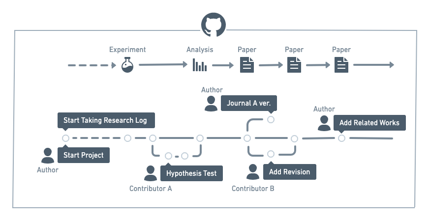

# Managing the Whole Research Process on GitHub
This repository contains the LaTeX source and assets for *"Managing the Whole Research Process on GitHub"*.



## Citation
```
@inproceedings{
takagi2022managing,
title={Managing the Whole Research Process on GitHub},
author={Shiro Takagi},
booktitle={NeurIPS Workshop on Broadening Research Collaborations in ML},
year={2022}
}
```